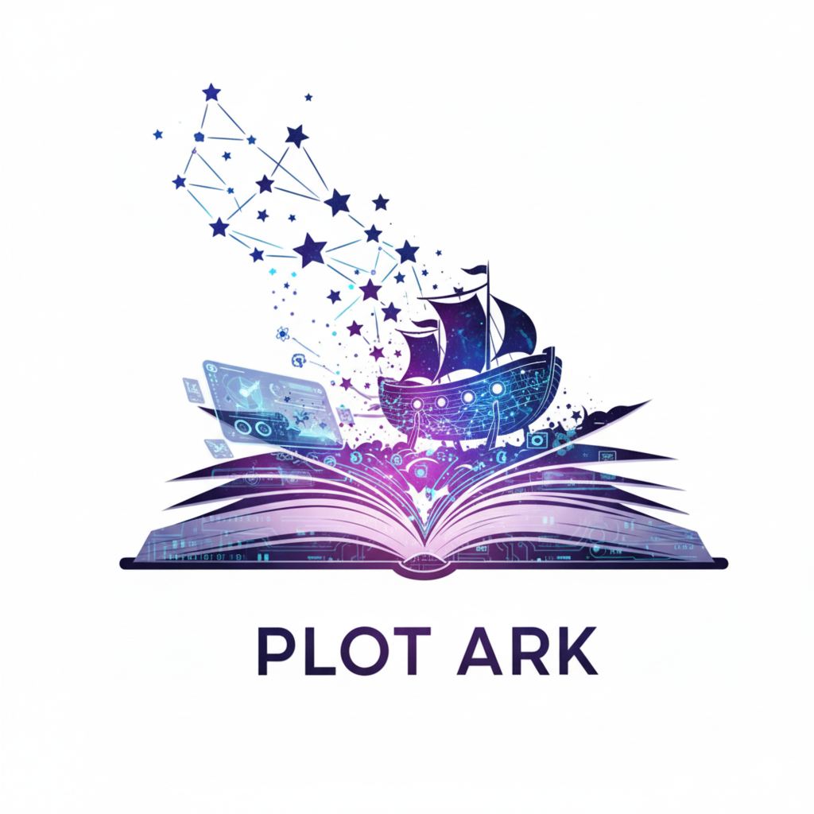

[English](README.md) | [中文](README.zh.md)

# Plot Ark — Agentic Curriculum Engine

[](https://www.gnu.org/licenses/agpl-3.0)
[](https://github.com/Schlaflied/Plot-Ark/stargazers)
[](https://github.com/Schlaflied/Plot-Ark/forks)
[](https://docs.docker.com/compose/)
[](https://www.python.org/)
[](https://flask.palletsprojects.com/)
[](https://react.dev/)
[](https://www.postgresql.org/)
[](https://redis.io/)
[](https://github.com/HKUDS/LightRAG)
[](https://xapi.com/)
[](https://tavily.com/)
[](https://www.imsglobal.org/)

<p align="center">
  
</p>

**An open-source agentic curriculum engine that generates pedagogically grounded course content through narrative frameworks.**

> Unlike static AI course generators, Plot Ark applies evidence-based instructional design principles — Bloom's Taxonomy, Krashen's i+1 difficulty scaffolding, and Cognitive Load Theory — so the curriculum it generates is structured the way learning actually works.

> **Agentic pipeline** — a Tavily research agent searches real academic sources first, then injects verified URLs into the generation prompt. No hallucinated citations.

> **Multi-provider AI** — switch between OpenAI (GPT-4o-mini) and Google Gemini via a single env variable. Bring your own key.

---

## 🎬 Demo

**syllabus upload** — drop PDF/DOCX → auto-fill form fields + extract required readings


**research agent&human in the loop** — Tavily research agent → human source review → approve/reject


**module adjuistment** — drag-and-drop reorder, inline editing, all fields editable


**Knowledge Graph** — concept map, node detail, natural language query with node highlight


▶ [Full demo video (Google Drive)](https://drive.google.com/file/d/14SLOJFImW9TqyyXipJL1wumkptir7WuU/view?usp=sharing)

---

## ✨ Features

<details>
<summary><strong>🧠 Curriculum Generation</strong></summary>

- **Agentic source research** — Tavily agent runs multi-type queries across academic (JSTOR, Springer, ResearchGate…), video (TED, Coursera, YouTube), and news (HBR, Economist, NYT) domains before generation begins
- **Grounded citations** — verified real URLs injected into the prompt; sources panel shows full titles, type badges (📄/🎬/📰), and estimated read/watch time
- **Structure self-check** — after generation, validates complexity_level progression and module count; auto-retries once if structure is invalid
- **Bloom's Taxonomy alignment** — course code (e.g. ACCT 301) automatically maps to the correct cognitive level (Remember → Create)
- **i+1 difficulty progression** — complexity_level increases across modules so each one builds on the last
- **Cognitive Load constraints** — max 2 readings per module, each with explicit pedagogical rationale
- **Course typology** — project-based, essay, debate/roleplay, lab/simulation, or mixed assessment formats
- **SSE streaming** — content streams token-by-token; research agent status shown before generation starts
- **Syllabus import** — upload PDF or DOCX; GPT extracts topic, course code, level, audience, module count, and required readings to pre-fill the form
- **Course narrative** — a 2–3 sentence "story of the course" generated at the skeleton phase; professor-editable, student read-only

</details>

<details>
<summary><strong>✏️ Module Editor</strong></summary>

- **Single-card navigation** — left/right arrows through modules, or click the sidebar index
- **Drag-and-drop reordering** — restructure the sequence without regenerating
- **Inline editing** — edit every field across all three tabs (Objectives, Resources, Assessment)
- **Add / remove items** — learning objectives, readings, assignments all editable
- **Resource cards** — each reading shows type badge, estimated time, and links directly to the source
- **LocalStorage persistence** — edits survive page refresh
- **Course narrative editing** — professor can edit the course-level narrative inline; students see read-only version

</details>

<details>
<summary><strong>📦 Export</strong></summary>

- **IMS Common Cartridge (.imscc)** — direct import into Canvas, Moodle, D2L
- **PDF export** — client-side jsPDF; readings listed as inline titles per module, full citations collected in a References section at the end
- **DOCX export** — python-docx backend; same structure as PDF
- **Markdown export** — full curriculum with readings and assignments as a .md file
- **Citation format selector** — APA / MLA / Chicago, applied across all export formats
- **Copy to clipboard** — paste into any editor

</details>

<details>
<summary><strong>🕸️ Knowledge Graph (LightRAG)</strong></summary>

- **Material ingestion** — right-side panel always visible; drag-and-drop PDF/PPTX upload (max 15 files, 50MB each); per-file progress tracking; Build Graph button triggers LightRAG ingestion
- **Undergraduate year sidebar** — Year 1–4 + All Courses navigation; courses organized by academic year
- **Course management** — course banner with pill navigation per year; add/delete/rename/drag-reorder course pills; each course has an editable full name tag; changes auto-saved to localStorage
- **Dynamic subject tabs** — add/delete/rename/drag-reorder subject tabs; tab state persists across sessions
- **Force-directed visualization** — interactive 2D graph with warm brown palette; node size scales with connection count
- **Node detail panel** — click any concept to see its definition and connection count
- **Fullscreen mode** — fullscreen toggle with ESC key support
- **Course search** — search courses by name or code across all years; auto-navigates to correct year
- **Concept search** — filter and highlight matching nodes across the graph
- **Knowledge query** — ask natural language questions against the graph; Redis-cached answers (persistent cache)
- **Query history** — starred + deletable history of past questions with subject tags
- **Persistent event loop** — LightRAG async engine runs on a dedicated background thread; no cold-start penalty after first query

</details>

<details>
<summary><strong>🤖 Agentic Layer (Roadmap)</strong></summary>

- **xAPI mini-LRS** — mock learner behavior (experienced/completed/struggled/passed) feeds a professor-facing Student Data panel; learner state bars, struggling concept insights, statement feed
- **xAPI event collection** — fine-grained learner behavior (watched, skipped, struggled)
- **Redis learner state** — real-time profile (mastered / struggling / recommended_next)
- **Professor LTM** — system learns instructor preferences from edit history (diff-based, no surveys)
- **Multilingual concept bridging** — explain in learner's native language, preserve English terminology

</details>

## 🧭 Design Philosophy

Most EdTech AI tools treat artificial intelligence as a threat to be monitored — detecting whether students used AI, flagging "inauthentic" work, enforcing originality.

Plot Ark takes the opposite position.

**AI is a cognitive tool, not a threat.** A student who uses AI to draft an answer, then understands it, refines it, and can explain it in their own words — that student has learned. Copy-paste without comprehension is a student deceiving themselves, not a system to be policed.

Plot Ark has no AI detection mechanism. It never will. The question it asks is not *"did you use AI?"* but *"did learning happen?"* — and it answers that through Bloom's Taxonomy alignment, i+1 difficulty progression, and xAPI learner behavior tracking.

The curriculum engine itself is built the same way: AI generates the structure, pedagogy constrains the output, and the instructor stays in the loop. The tool thinks; the human decides.

---

## 🏗️ Architecture

**Course Generation Pipeline**


**RAG & Knowledge Graph Ingestion**


**Planned agentic loop:**
```
xAPI behavior events → Curriculum Agent → Redis learner state → Narrative Engine → LMS
```

---

## 🛠️ Tech Stack

| Layer | Technology | Role |
|-------|-----------|------|
| **Frontend** | React + TypeScript + Vite | Module editor, SSE client, drag-and-drop |
| **Backend** | Python + Flask + SSE | Streaming curriculum generation |
| **AI** | OpenAI GPT-4o-mini / Google Gemini | Content generation (pluggable via `AI_PROVIDER`) |
| **Research Agent** | Tavily Search API | Pre-generation academic source retrieval |
| **History** | PostgreSQL | Persistent curriculum storage with favorites |
| **Cache** | Redis | Learner state (roadmap) |
| **Knowledge Graph** | LightRAG + networkx + react-force-graph-2d | Course material ingestion → interactive concept graph |
| **Graph Cache** | Redis + in-memory | Query result cache (persistent cache) + rag instance reuse |
| **Behavior Data** | xAPI 1.0.3 + mini-LRS | Statement ingestion → Redis learner state → professor analytics panel (mock data; real LMS integration roadmap) |
| **Export** | IMS Common Cartridge | LMS-compatible output |
| **Dev** | Docker Compose | Single-command local environment |

---

## 🚀 Quick Start

**Prerequisites:** Docker, an OpenAI or Gemini API key, a Tavily API key (free tier at tavily.com)

```bash
git clone https://github.com/Schlaflied/Plot-Ark
cd Plot-Ark

cp .env.example .env
# Set AI_PROVIDER=openai or AI_PROVIDER=gemini
# Add the corresponding API key + TAVILY_API_KEY

docker compose up --build
```

| Service | URL |
|---------|-----|
| Frontend | http://localhost:5173 |
| Backend | http://localhost:5000 |

---

## 🕸️ Using the Knowledge Graph

The knowledge graph feature lets you ingest your own course materials (PDFs or PPTXs) and explore them as an interactive concept map.

### 1. Add your materials

Drop your course PDFs and/or PPTXs into subject folders under `data/materials/`:

```
data/materials/
├── your-subject/          ← one folder per subject
│   ├── week1.pdf
│   ├── week2.pptx
│   └── ...
└── another-subject/
    └── ...
```

### 2. Run the ingestion script

```bash
# Set your OpenAI key first (used for gpt-4o-mini + text-embedding-3-small)
export OPENAI_API_KEY=sk-...

# Run inside the backend container
docker compose exec backend python ingest.py \
  --input data/materials/your-subject \
  --storage data/lightrag_storage_yoursubject
```

Ingestion cost estimate: ~$0.10–0.30 per 10 PDFs (gpt-4o-mini rates).

### 3. Register the subject in the backend

In `backend/app.py`, add your subject to the `SUBJECT_MAP` (search for `lightrag_storage_call`) following the existing pattern.

### 4. Add the tab in the frontend

In `frontend/components/GraphViewer.tsx`, add your subject to `SUBJECT_TABS`:

```tsx
const SUBJECT_TABS = [
  { key: 'all', label: 'All' },
  { key: 'business-law', label: 'Business Law' },
  { key: 'call', label: 'CALL' },
  { key: 'your-subject', label: 'Your Subject' },  // ← add here
];
```

### 5. Open the Knowledge Graph tab

Navigate to **Knowledge Graph** in the top nav. Select your subject tab, explore the concept map, and use the query bar to ask natural language questions about your materials.

---

## 📁 Project Structure

```
plot-ark/
├── docker-compose.yml
├── .env.example
├── docs/
│   ├── architecture.md
│   ├── Syllabus Upload.gif          ← Demo: syllabus import → form auto-fill
│   ├── research agent&human in the loop.gif  ← Demo: research agent + source review
│   ├── module adjuistment.gif       ← Demo: module editing + drag-and-drop
│   └── Knowledge graph .gif         ← Demo: year sidebar, course management, fullscreen, query
├── frontend/                        ← React + TypeScript + Vite
│   ├── Dockerfile
│   ├── index.tsx                    ← Entry point
│   ├── App.tsx                      ← Main UI (curriculum engine + student view)
│   ├── components/
│   │   └── GraphViewer.tsx          ← LightRAG knowledge graph viewer
│   └── vite.config.ts
├── backend/                         ← Flask
│   ├── Dockerfile
│   ├── app.py                       ← SSE endpoint, Bloom's mapping, graph API
│   └── ingest.py                    ← LightRAG ingestion script (PDF + PPTX)
└── data/
    ├── materials/                   ← Drop course PDFs/PPTXs here (gitignored)
    ├── lightrag_storage/            ← Business Law graph (gitignored, regenerate)
    └── lightrag_storage_call/       ← CALL graph (gitignored, regenerate)
```

---

## 🗺️ Roadmap

- [x] Flask SSE streaming backend
- [x] React frontend with module card navigation
- [x] Docker Compose dev environment
- [x] Bloom's Taxonomy course code mapping
- [x] i+1 difficulty progression
- [x] Inline module editing (all fields)
- [x] Drag-and-drop module reordering
- [x] IMS Common Cartridge + Markdown export
- [x] Tavily agentic research pipeline — real academic sources before generation
- [x] PostgreSQL history — persist, favorite, and delete curricula
- [x] LMS-style module sidebar (D2L Brightspace-inspired layout)
- [x] Multi-type resource pipeline — academic / video / news with type badges and estimated time
- [x] Structure self-check with auto-retry — validates complexity progression and module count
- [x] LightRAG knowledge graph — PDF/PPTX ingestion → interactive force-directed concept map
- [x] Knowledge graph query — natural language Q&A against course material graph, Redis-cached
- [ ] Assignment Timeline + Due Date calculator
- [x] Human-in-the-loop source review — approve/reject Tavily results before generation
- [x] xAPI mini-LRS — statement ingestion, learner state, professor analytics panel (mock data)
- [x] Syllabus import — PDF/DOCX → auto-fill form + extract required readings
- [x] Course narrative — course-level story generated at skeleton phase, professor-editable
- [x] Citation format selector — APA / MLA / Chicago across all exports
- [x] PDF + DOCX export — client-side jsPDF and python-docx backend
- [x] Multi-course management — dynamic course slots with add/delete/rename/drag-reorder
- [x] My Courses dashboard — card grid with course history overview
- [x] Knowledge Graph course management — year sidebar, course banner, dynamic subject tabs, fullscreen, course search
- [x] Knowledge Graph ingestion panel — drag-and-drop material upload, always-visible right panel
- [ ] Redis learner state management
- [ ] Professor LTM — preference learning from edit history
- [ ] LTI 1.3 — push into Canvas / Moodle

---

## 📄 License

GNU Affero General Public License v3.0 — see [LICENSE](LICENSE)

- Free for personal use, research, and open-source projects
- Modifications must be open-sourced under the same license
- Network deployment requires your product to also be open-source
- Commercial licensing — open a GitHub Issue

---

## ⭐ Star History

<a href="https://www.star-history.com/?repos=Schlaflied%2FPlot-Ark&type=date&legend=top-left">
 <picture>
   <source media="(prefers-color-scheme: dark)" srcset="https://api.star-history.com/image?repos=Schlaflied/Plot-Ark&type=date&theme=dark&legend=top-left" />
   <source media="(prefers-color-scheme: light)" srcset="https://api.star-history.com/image?repos=Schlaflied/Plot-Ark&type=date&legend=top-left" />
   
 </picture>
</a>

---

## 🙏 Acknowledgements

Architectural inspiration from [Hive](https://github.com/aden-hive/hive) (YC-backed AI agent infrastructure) — the node pipeline, shared memory, and evolution loop patterns informed the agentic curriculum engine design.

Knowledge graph layer powered by [LightRAG](https://github.com/HKUDS/LightRAG) (HKUDS) — incremental knowledge graph construction and prerequisite inference across course materials.

Two-phase generation pipeline design inspired by [OpenMAIC](https://github.com/THU-MAIC/OpenMAIC) (Tsinghua University) — the outline-first, then expand pattern informed Plot Ark's curriculum skeleton generation approach.

Built with [Claude](https://claude.ai) (Anthropic) as AI pair programmer.

Special thanks to the two chief quality assurance officers who supervised every late-night coding session — **Icy** (冰糖, white) and **雪梨** (calico):

<p align="center">
  
</p>

---

<div align="center">

[Report Bug](https://github.com/Schlaflied/Plot-Ark/issues) · [Request Feature](https://github.com/Schlaflied/Plot-Ark/issues)

**Star this repo if it's useful.**

</div>
