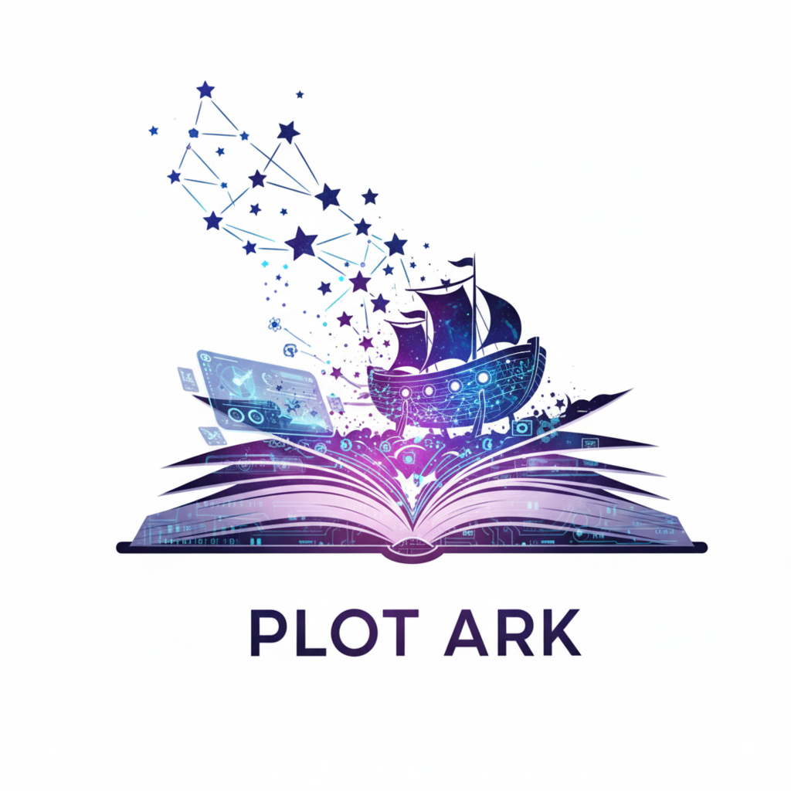

[English](README.md) | [中文](README.zh.md)

# Plot Ark — Agentic Curriculum Engine

[](https://www.gnu.org/licenses/agpl-3.0)
[](https://github.com/Schlaflied/Plot-Ark/stargazers)
[](https://github.com/Schlaflied/Plot-Ark/forks)
[](https://docs.docker.com/compose/)
[](https://www.python.org/)
[](https://flask.palletsprojects.com/)
[](https://react.dev/)
[](https://www.postgresql.org/)
[](https://redis.io/)
[](https://github.com/HKUDS/LightRAG)
[](https://xapi.com/)
[](https://tavily.com/)
[](https://www.imsglobal.org/)
[](https://github.com/Jenqyang/Awesome-AI-Agents)
[](https://github.com/aden-hive/hive)
[](https://github.com/aden-hive/hive/pulls?q=author%3ASchlaflied)

<p align="center">
  
</p>

<h3 align="center">
  👉 <a href="https://schlaflied.github.io/Plot-Ark/">Visit the Official Landing Page</a> 👈
</h3>

**An open-source agentic curriculum engine that generates pedagogically grounded course content through narrative frameworks.**

> Unlike static AI course generators, Plot Ark applies evidence-based instructional design principles — Bloom's Taxonomy, Krashen's i+1 difficulty scaffolding, and Cognitive Load Theory — so the curriculum it generates is structured the way learning actually works.

> **Agentic pipeline** — a Tavily research agent searches real academic sources first, then injects verified URLs into the generation prompt. No hallucinated citations.

> **Multi-provider AI** — switch between OpenAI (GPT-4o-mini) and Google Gemini via a single env variable. Bring your own key.

---

## 🎬 Demo

**Course generation** — agentic source retrieval, syllabus import, and interactive module adjustment


**AI suggestion within course generation** — AI tutors and teaching suggestions directly within the curriculum editor


**Student panel with four buttons** — per-module sentiment collection feeding into the analytics loop


**xAPI student data analysis** — 5-node A2A agent pipeline simulating and detecting learner risk


**Curriculum agent & xAPI rerun** — human-in-the-loop module optimization based on learner data


▶ [Full demo video (Google Drive)](https://drive.google.com/file/d/14SLOJFImW9TqyyXipJL1wumkptir7WuU/view?usp=sharing)

▶ [xAPI + A2A Analytics demo (Google Drive)](https://drive.google.com/file/d/1CVrWfrJ1gGUDf-VD1E9p443-7DKJs5MM/view?usp=drive_link)

---

## ✨ Features

<details>
<summary><strong>🧠 Curriculum Generation</strong></summary>

- **Agentic source research** — Tavily agent runs multi-type queries across academic (JSTOR, Springer, ResearchGate…), video (TED, Coursera, YouTube), and news (HBR, Economist, NYT) domains before generation begins
- **Grounded citations** — verified real URLs injected into the prompt; sources panel shows full titles, type badges (📄/🎬/📰), and estimated read/watch time
- **Structure self-check** — after generation, validates complexity_level progression and module count; auto-retries once if structure is invalid
- **Bloom's Taxonomy alignment** — course code (e.g. ACCT 301) automatically maps to the correct cognitive level (Remember → Create)
- **i+1 difficulty progression** — complexity_level increases across modules so each one builds on the last
- **Cognitive Load constraints** — max 2 readings per module, each with explicit pedagogical rationale
- **Course typology** — project-based, essay, debate/roleplay, lab/simulation, or mixed assessment formats
- **SSE streaming** — content streams token-by-token; research agent status shown before generation starts
- **Syllabus import** — upload PDF or DOCX; GPT extracts topic, course code, level, audience, module count, and required readings to pre-fill the form
- **Course narrative** — a 2–3 sentence "story of the course" generated at the skeleton phase; professor-editable, student read-only

</details>

<details>
<summary><strong>✏️ Module Editor</strong></summary>

- **Single-card navigation** — left/right arrows through modules, or click the sidebar index
- **Drag-and-drop reordering** — restructure the sequence without regenerating
- **Inline editing** — edit every field across all three tabs (Objectives, Resources, Assessment)
- **Add / remove items** — learning objectives, readings, assignments all editable
- **Resource cards** — each reading shows type badge, estimated time, and links directly to the source
- **LocalStorage persistence** — edits survive page refresh
- **Course narrative editing** — professor can edit the course-level narrative inline; students see read-only version

</details>

<details>
<summary><strong>📦 Export</strong></summary>

- **IMS Common Cartridge (.imscc)** — direct import into Canvas, Moodle, D2L
- **PDF export** — client-side jsPDF; readings listed as inline titles per module, full citations collected in a References section at the end
- **DOCX export** — python-docx backend; same structure as PDF
- **Markdown export** — full curriculum with readings and assignments as a .md file
- **Citation format selector** — APA / MLA / Chicago, applied across all export formats
- **Copy to clipboard** — paste into any editor

</details>

<details>
<summary><strong>🕸️ Knowledge Graph (LightRAG)</strong></summary>

- **Material ingestion** — right-side panel always visible; drag-and-drop PDF/PPTX upload (max 15 files, 50MB each); per-file progress tracking; Build Graph button triggers LightRAG ingestion
- **Undergraduate year sidebar** — Year 1–4 + All Courses navigation; courses organized by academic year
- **Course management** — course banner with pill navigation per year; add/delete/rename/drag-reorder course pills; each course has an editable full name tag; changes auto-saved to localStorage
- **Dynamic subject tabs** — add/delete/rename/drag-reorder subject tabs; tab state persists across sessions
- **Force-directed visualization** — interactive 2D graph with warm brown palette; node size scales with connection count
- **Node detail panel** — click any concept to see its definition and connection count
- **Fullscreen mode** — fullscreen toggle with ESC key support
- **Course search** — search courses by name or code across all years; auto-navigates to correct year
- **Concept search** — filter and highlight matching nodes across the graph
- **Knowledge query** — ask natural language questions against the graph; Redis-cached answers (persistent cache)
- **Query history** — starred + deletable history of past questions with subject tags
- **Persistent event loop** — LightRAG async engine runs on a dedicated background thread; no cold-start penalty after first query

</details>

<details>
<summary><strong>🤖 A2A Multi-Agent Analytics</strong></summary>

- **5-node pipeline** — `Orchestrator → [BehaviorAnalyst ‖ RiskDetector ‖ ContentOptimizer ‖ CohortComparator] → aggregate → LTM snapshot`. All agents are currently sql-only (Phase 2 = LLM integration pending).
- **PII anonymisation** — student names/emails are anonymised before agent processing; real identities are restored only in the final aggregated report for the professor.
- **xAPI mock data engine** — 4 noise levels (5%/10%/15%/20%) seeded from frontend UI; realistic 6-week timestamp distribution with `HOUR_WEIGHTS` and profile-based student spread (high_performer / average / struggling / disengaged). **Curriculum-aware**: queries `change_log` for applied modules and uses `IMPROVED_VERB_DIST` to simulate realistic post-optimization improvement.
- **Hive-style node architecture** — each agent inherits `BaseNode` with reflexion/retry (max 3), L3 JSON Schema validation, and SQL fallback
- **SharedMemory (Redis)** — agents communicate through Redis-backed shared memory (`a2a:{session_id}:{key}`) with local dict fallback
- **Token usage tracking** — `NodeResult` carries `tokens_in / tokens_out / tokens_cache_read / tokens_cache_write`. Orchestrator prints a token summary table to backend log after each run; report JSON includes a `token_summary` block. Frontend sidebar shows a Token Usage panel (currently all zero — sql-only Phase 1).
- **LTM 3-layer architecture** — Hot (Redis, pipeline runtime), Warm (PostgreSQL `course_analysis_snapshots`, persisted per-run), Cold (`data/ltm/*.md` YAML+Markdown, versioned with course codes)
- **Historical trend visualization** — `TrendChart.tsx` (pure SVG) shows at-risk % and completion rate over time; mini mode + full-screen modal with date labels, larger data points, and summary stat cards
- **SSE real-time streaming** — analysis progress streams via Server-Sent Events; frontend shows live agent status
- **Student Data dashboard** — dedicated full-page analytics view with resizable sidebar, section navigation, noise-level selector, and Token Usage panel
- **Risk detection** — 6 signals; thresholds: medium ≥ 4, high ≥ 7; inactivity windows: 14 / 21 days
- **Cohort comparison** — students grouped into high_performers / average / at_risk / disengaged with avg completion and struggle rates
- **6-section report export** — PDF (Anthropic-style cover), DOCX, Excel. Sections: Behavior Analysis, Risk Assessment, Content Optimization, Cohort Comparison, **Analysis History** (table + matplotlib trend chart), Overview & Recommended Actions. Filenames include course slug + noise label.

</details>

<details>
<summary><strong>🎯 Curriculum Agent — Agentic Curriculum Optimization</strong></summary>

- **Professor Notification Bar** — persistent amber bar on CoursePage alerts professors when suggestions are available, with "Dismiss" and "Review →" buttons
- **Professor Slide-out Drawer** — clicking "Review" opens a 400px drawer with Pending Suggestions (Apply) and Applied Changes (Redo) sections; Redo restores original module content
- **Student Notification Bar** — blue bar shows "N modules updated — based on instructor optimization" with Dismiss and Review buttons
- **Student Slide-out Drawer** — clicking "Review" opens a blue-themed drawer listing updated modules with "Go to Module" navigation buttons
- **Draggable Floating Action Button (FAB)** — after dismissing either banner, a draggable floating ball (🤖 amber / ✨ blue) appears at bottom-right; click opens the drawer directly without restoring the banner; hover reveals ✕ to permanently dismiss; supports free-drag to any screen position
- **Human-in-the-loop Apply** — clicking "Apply" opens a confirmation modal with before/after preview; professor explicitly approves each change
- **Redo (Undo Apply)** — applied changes store original module data as backup; clicking "Redo" restores the module to its pre-apply state and moves the suggestion back to Pending
- **Module Flags** — `module_flags` table stores flagged modules with signal sources, flag levels (yellow / orange), and detailed metrics
- **Change Log** — `change_log` table records all recommendations with status tracking (pending → applied → dismissed) and backup_data for redo
- **Cross-course coverage** — seed script auto-discovers all courses and generates flags + suggestions with backup data for every course
- **Analytics redirect** — "View Full Analytics →" in the professor drawer navigates to the Student Data analytics page

</details>

## 🧭 Design Philosophy

Most EdTech AI tools treat artificial intelligence as a threat to be monitored — detecting whether students used AI, flagging "inauthentic" work, enforcing originality.

Plot Ark takes the opposite position.

**AI is a cognitive tool, not a threat.** A student who uses AI to draft an answer, then understands it, refines it, and can explain it in their own words — that student has learned. Copy-paste without comprehension is a student deceiving themselves, not a system to be policed.

Plot Ark has no AI detection mechanism. It never will. The question it asks is not *"did you use AI?"* but *"did learning happen?"* — and it answers that through Bloom's Taxonomy alignment, i+1 difficulty progression, and xAPI learner behavior tracking.

The curriculum engine itself is built the same way: AI generates the structure, pedagogy constrains the output, and the instructor stays in the loop. The tool thinks; the human decides.

Anthropic's Economic Index (Jan 2026) found r = 0.925 between prompt sophistication and response sophistication — the deeper you engage it, the deeper it responds.

---

## 🏗️ Architecture

**System Architecture**

```
┌────────────────────────────────────────────────────────────────────────────┐
│  Frontend (React + TypeScript + Vite)                                      │
│  ┌──────────┐ ┌──────────┐ ┌──────────┐ ┌───────────┐ ┌───────────────┐  │
│  │ Generate  │ │ Courses  │ │  Course  │ │ Knowledge │ │ Student Data  │  │
│  │   Page    │ │   Page   │ │   Page   │ │   Graph   │ │    Page       │  │
│  └────┬─────┘ └────┬─────┘ └────┬─────┘ └─────┬─────┘ └──────┬────────┘  │
│       │            │            │              │              │           │
│  components/ui/  components/generate/    components/analytics/           │
│  (Select, Input)   (SyllabusUpload)   (TrendChart, ReportSections, ...)  │
│                                              SSE streaming               │
└───────┼────────────┼────────────┼──────────────┼──────────────┼──────────┘
        │            │            │              │              │
        ▼            ▼            ▼              ▼              ▼
┌────────────────────────────────────────────────────────────────────────────┐
│  Backend (Flask + Blueprints)                                              │
│  ├── app.py (~30 lines, routing)         ├── config.py (Env constants)     │
│  ├── extensions.py (Global instances)    ├── async_loop.py (Event loop)    │
│  ├─────────────────────────────────────────────────────────────────────┐   │
│  │  routes/                                                            │   │
│  │  ├── curriculum.py           generate / skeleton / expand / save     │   │
│  │  ├── curriculum_agent_routes flags / suggestions / apply / redo      │   │
│  │  ├── history.py              CRUD + favorite + DOCX export          │   │
│  │  ├── analytics.py            A2A SSE + history API + export         │   │
│  │  ├── xapi.py                 xAPI statements + mock data seed       │   │
│  │  ├── feedback.py             Student sentiment + comments           │   │
│  │  ├── graph.py                KG data + RAG query                    │   │
│  │  ├── sources.py              Tavily source preview                  │   │
│  │  ├── syllabus.py             PDF/DOCX parse + import                │   │
│  │  └── materials.py            LightRAG ingest                        │   │
│  └─────────────────────────────────────────────────────────────────────┘   │
│  ┌─────────────────────────────┐  ┌────────────────────────────────────┐   │
│  │  agents/ (Hive-style A2A)   │  │  services/                         │   │
│  │  ├── base.py (BaseNode)     │  │  ├── research.py (Tavily)          │   │
│  │  ├── orchestrator.py        │  │  ├── file_parser.py                │   │
│  │  ├── behavior_analyst.py    │  │  ├── prompt_builder.py             │   │
│  │  ├── risk_detector.py       │  │  ├── xapi_generator.py (⚡ aware)  │   │
│  │  ├── content_optimizer.py   │  │  ├── report_exporter.py (facade)   │   │
│  │  ├── cohort_comparator.py   │  │  ├── chart_generator.py (+history) │   │
│  │  └── curriculum_agent.py    │  │  ├── ltm_writer.py (Cold layer)    │   │
│  │       SharedMemory          │  │  ├── threshold_checker.py           │   │
│  └──────────┬──────────────────┘  │  └── export_{pdf,docx,excel}.py    │   │
│             │                     └─────────────┬──────────────────────┘   │
└─────────────┼───────────────────────────────────┼──────────────────────────┘
              │                                   │
              ▼                                   ▼
┌───────────────────┐  ┌──────────────┐  ┌──────────────┐  ┌──────────────┐
│  PostgreSQL       │  │    Redis     │  │   LightRAG   │  │  data/ltm/   │
│  (curricula       │  │  (🔴 Hot:    │  │   (KG data)  │  │  (🔵 Cold:   │
│  + xapi           │  │   pipeline   │  │              │  │   .md YAML   │
│  + 🟡 Warm:       │  │   runtime)   │  │              │  │   snapshots) │
│  snapshots)       │  │              │  │              │  │              │
└───────────────────┘  └──────────────┘  └──────────────┘  └──────────────┘
```

**LTM (Long-Term Memory) Architecture**

```
┌─────────────────────────────────────────────────────────────────────────┐
│                     LTM 3-Layer Architecture                            │
├──────────────────┬───────────────────┬──────────────────────────────────┤
│  🔴 Hot Layer     │  🟡 Warm Layer      │  🔵 Cold Layer                   │
│  Redis            │  PostgreSQL         │  data/ltm/*.md                   │
│                  │                     │                                  │
│  • Pipeline       │  • course_analysis_ │  • YAML frontmatter              │
│    runtime state  │    snapshots table  │    (course_code, topic,          │
│  • SSE streaming  │  • Per-run metrics  │     curriculum_version)          │
│  • Token usage    │  • at_risk_count    │  • Module performance table      │
│  • TTL auto-      │  • completion rates │  • Applied changes log           │
│    expire         │  • verb_distribution│  • 🤖 Agent vs 👤 Prof tracking   │
│                  │  • Historical trend │  • Versioned: _v{N} per day      │
│                  │    chart source     │  • Never deleted                 │
└──────────────────┴───────────────────┴──────────────────────────────────┘
```

**Course Generation Pipeline**


**RAG & Knowledge Graph Ingestion**


**A2A Multi-Agent Analytics Architecture**


**A2A Analytics Pipeline**


**Active agentic loop:**
```
xAPI events → A2A Assessment → LTM (Hot+Warm+Cold) → Curriculum Agent → Professor HITL → Apply → ⚡ Curriculum-aware re-seed → A2A re-assessment (improved data) → updated LTM
```

---

## 🛠️ Tech Stack

| Layer | Technology | Role |
|-------|-----------|------|
| **Frontend** | React + TypeScript + Vite | Module editor, A2A dashboard, SSE client, drag-and-drop |
| **Backend** | Python + Flask Blueprints | Modular route-based API (8 Blueprints + 6 Agents + 5 Services) |
| **AI** | OpenAI GPT-4o / Google Gemini | Content generation & A2A analysis (via `AI_PROVIDER`) |
| **Research Agent** | Tavily Search API | Pre-generation academic source retrieval |
| **Database** | PostgreSQL | Curricula, xAPI statements, student feedback, `course_analysis_snapshots` (LTM) |
| **Cache & Memory**| Redis | Graph query cache, learner state, A2A shared memory (`a2a:{session}:{key}`) |
| **Knowledge Graph**| LightRAG + networkx + react-force-graph-2d| Course material ingestion → interactive concept graph |
| **Behavior Data** | xAPI 1.0.3 + mini-LRS | Statement ingestion → mock data engine (4 noise levels) → professor analytics panel |
| **Analytics Engine**| A2A multi-agent (Hive-style, sql-only Phase 1) | 5-node pipeline: Orchestrator + 4 parallel agents; token tracking; LTM snapshot |
| **Report Export** | ReportLab + python-docx + openpyxl + matplotlib | PDF (Anthropic-style cover), DOCX, Excel; filenames include course slug + noise label |
| **Curriculum Export** | IMS Common Cartridge + DOCX + PDF + Markdown | LMS-compatible output in multiple formats |
| **Dev** | Docker Compose | Single-command local environment (frontend :5173, backend :5000) |

---

## 🚀 Quick Start

**Prerequisites:** Docker, an OpenAI or Gemini API key, a Tavily API key (free tier at tavily.com)

```bash
git clone https://github.com/Schlaflied/Plot-Ark
cd Plot-Ark

cp .env.example .env
# Set AI_PROVIDER=openai or AI_PROVIDER=gemini
# Add the corresponding API key + TAVILY_API_KEY

docker compose up --build
```

| Service | URL |
|---------|-----|
| Frontend | http://localhost:5173 |
| Backend | http://localhost:5000 |

---

## 🕸️ Using the Knowledge Graph

The knowledge graph feature lets you ingest your own course materials (PDFs, PPTXs, or DOCXs) and explore them as an interactive concept map.

1. Go to the **Knowledge Graph** tab
2. In the **Upload Materials** panel on the right, fill in:
   - **Subject name** (required) — e.g. "Organizational Behavior"
   - **Course code** (optional) — e.g. "ADMS 2400"
   - **Year** (required) — which year of study this course belongs to
3. Drop your PDF / PPTX / DOCX files into the dropzone
4. Click **Build Graph** — ingestion runs in the background (~$0.10–0.30 per 10 PDFs at gpt-4o-mini rates)
5. Once complete, the graph appears automatically under the correct year and course tab

---

## 📁 Project Structure

```
plot-ark/
├── docker-compose.yml
├── .env.example
├── docs/
│   ├── Course generation.gif                    ← Demo: Agentic generation, syllabus import, module adjustment
│   ├── AI suggestion within course generation.gif ← Demo: In-editor AI tutors and suggestions
│   ├── Student panel with four buttons.gif      ← Demo: Per-module sentiment collection
│   ├── xAPI student data analysis.gif           ← Demo: 5-node A2A agent pipeline and report export
│   └── Curriculum agent & xAPI rerun.gif        ← Demo: Human-in-the-loop module optimization
│
├── backend/                             ← Flask (modular Blueprints)
│   ├── app.py                           ← Entry point (~30 lines, registers Blueprints)
│   ├── config.py                        ← Pure setup constants and environment variables
│   ├── extensions.py                    ← Global service singletons (Flask app, AI, Redis)
│   ├── async_loop.py                    ← Background event loop manager
│   ├── db.py                            ← PostgreSQL operations
│   ├── constants.py                     ← Bloom's taxonomy, session constraints, formats
│   ├── routes/
│   │   ├── curriculum.py                ← /api/curriculum/* (generate, skeleton, expand, save)
│   │   ├── curriculum_agent_routes.py   ← /api/curriculum/ flags, suggestions, apply, redo, changes
│   │   ├── history.py                   ← /api/history/* + /api/curriculum/export/docx
│   │   ├── sources.py                   ← Tavily source preview
│   │   ├── graph.py                     ← KG data + RAG query
│   │   ├── xapi.py                      ← xAPI statements + seed generator
│   │   ├── analytics.py                 ← A2A SSE analysis + export endpoints
│   │   ├── feedback.py                  ← Student sentiment collection
│   │   ├── syllabus.py                  ← PDF/DOCX parse + import
│   │   └── materials.py                 ← LightRAG ingest
│   ├── agents/
│   │   ├── base.py                      ← BaseNode + SharedMemory + NodeResult
│   │   ├── orchestrator.py              ← Multi-agent coordinator with SSE
│   │   ├── behavior_analyst.py          ← xAPI verb/module engagement analysis
│   │   ├── risk_detector.py             ← Multi-signal at-risk scoring
│   │   ├── content_optimizer.py         ← Module performance cross-analysis
│   │   ├── cohort_comparator.py         ← Student cohort grouping
│   │   └── curriculum_agent.py          ← AI-driven curriculum optimization agent
│   ├── services/
│   │   ├── research.py                  ← Tavily search + credibility scoring
│   │   ├── file_parser.py               ← PDF/PPTX/DOCX text extraction
│   │   ├── prompt_builder.py            ← Centralized AI prompt templates
│   │   ├── lightrag_service.py          ← LightRAG instance management
│   │   ├── xapi_generator.py            ← Mock xAPI data (⚡ curriculum-aware, queries change_log)
│   │   ├── ltm_writer.py                ← LTM Cold layer (.md YAML snapshots)
│   │   ├── threshold_checker.py         ← Multi-signal module flag detection
│   │   ├── report_exporter.py           ← Thin facade for report generation
│   │   ├── chart_generator.py           ← Matplotlib charts + history trend chart
│   │   ├── export_pdf.py                ← ReportLab PDF (6 sections incl. Analysis History)
│   │   ├── export_docx.py               ← python-docx DOCX (6 sections incl. Analysis History)
│   │   └── export_excel.py              ← openpyxl Excel spreadsheet builder
│   ├── Dockerfile
│   └── requirements.txt
│
├── frontend/                            ← React + TypeScript + Vite
│   ├── App.tsx                          ← Router (React Router v7)
│   ├── pages/
│   │   ├── GeneratePage.tsx             ← Course generation form
│   │   ├── CoursePage.tsx               ← Module editor + export
│   │   ├── CoursesPage.tsx              ← Course dashboard
│   │   ├── GraphPage.tsx                ← Knowledge graph viewer
│   │   └── StudentDataPage.tsx          ← A2A multi-agent analytics dashboard
│   ├── components/
│   │   ├── ui/
│   │   │   ├── Select.tsx               ← Reusable dropdown
│   │   │   ├── Input.tsx                ← Reusable text input
│   │   │   ├── DraggableFab.tsx         ← Draggable floating action button (professor/student)
│   │   │   └── ToolbarDropdown.tsx      ← Icon-trigger toolbar dropdown menu
│   │   ├── dashboard/
│   │   │   ├── CourseCard.tsx            ← Course card, special card, add card
│   │   │   └── MiniCalendar.tsx          ← Compact monthly calendar widget
│   │   ├── generate/
│   │   │   ├── SyllabusUpload.tsx       ← Drag-and-drop syllabus upload
│   │   │   ├── SourceReview.tsx         ← Review Tavily research sources
│   │   │   └── SkeletonReview.tsx       ← Review course module skeleton
│   │   ├── analytics/
│   │   │   ├── ReportSections.tsx       ← A2A analytics report viewer component
│   │   │   ├── TrendChart.tsx           ← SVG trend chart (mini + full-view modal)
│   │   │   ├── CurriculumApplyModal.tsx ← AI suggestion apply confirmation modal
│   │   │   ├── CurriculumDrawer.tsx     ← Professor slide-out drawer (Apply / Redo)
│   │   │   ├── StudentChangesDrawer.tsx ← Student slide-out drawer (Go to Module)
│   │   │   ├── AISuggestionsSection.tsx ← AI exclusive suggestions detail section
│   │   │   ├── FlagBadge.tsx            ← Red/amber module issue flags
│   │   │   └── FlagModal.tsx            ← Detailed flag description & signal source
│   │   ├── ModuleCard.tsx               ← Individual curriculum module card
│   │   ├── ModuleSidebar.tsx            ← Navigation sidebar for modules
│   │   ├── GraphViewer.tsx              ← Core force-directed graph rendering
│   │   ├── GraphToolbar.tsx             ← Subject tabs, node/course search
│   │   ├── CourseBanner.tsx             ← Course pills, DnD, inline rename
│   │   ├── NodeDetailPanel.tsx          ← Node detail floating sidebar
│   │   ├── IngestPanel.tsx              ← File upload and lightrag pipeline
│   │   ├── QueryPanel.tsx               ← RAG query input and history
│   │   ├── YearSidebar.tsx              ← Year 1-4 lateral navigation
│   │   └── Diagrams.tsx                 ← Mermaid diagram component
│   ├── hooks/
│   │   ├── useIngest.ts                 ← Upload polling logic and state
│   │   ├── useQuery.ts                  ← RAG answer logic and history state
│   │   └── useCourseManager.ts          ← Course CRUD and persistence
│   ├── constants/
│   │   ├── theme.ts                     ← Shared GraphViewer UI constants
│   │   └── formOptions.ts               ← LEVELS, COURSE_TYPES, SESSION_DURATIONS
│   ├── Dockerfile
│   └── vite.config.ts
│
└── data/
    ├── materials/                       ← Course PDFs/PPTXs (gitignored)
    ├── ltm/                             ← LTM Cold layer .md snapshots (versioned YAML)
    └── lightrag_storage*/               ← Knowledge graph data (gitignored, regenerate)
```

---

## 🗺️ Roadmap

- [x] Flask SSE streaming backend
- [x] React frontend with module card navigation
- [x] Docker Compose dev environment
- [x] Bloom's Taxonomy course code mapping
- [x] i+1 difficulty progression
- [x] Inline module editing (all fields)
- [x] Drag-and-drop module reordering
- [x] IMS Common Cartridge + Markdown export
- [x] Tavily agentic research pipeline — real academic sources before generation
- [x] PostgreSQL history — persist, favorite, and delete curricula
- [x] LMS-style module sidebar (D2L Brightspace-inspired layout)
- [x] Multi-type resource pipeline — academic / video / news with type badges and estimated time
- [x] Structure self-check with auto-retry — validates complexity progression and module count
- [x] LightRAG knowledge graph — PDF/PPTX ingestion → interactive force-directed concept map
- [x] Knowledge graph query — natural language Q&A against course material graph, Redis-cached
- [ ] Assignment Timeline + Due Date calculator
- [x] Human-in-the-loop source review — approve/reject Tavily results before generation
- [x] xAPI mini-LRS — statement ingestion, learner state, professor analytics panel (mock data)
- [x] Syllabus import — PDF/DOCX → auto-fill form + extract required readings
- [x] Course narrative — course-level story generated at skeleton phase, professor-editable
- [x] Citation format selector — APA / MLA / Chicago across all exports
- [x] PDF + DOCX export — client-side jsPDF and python-docx backend
- [x] Multi-course management — dynamic course slots with add/delete/rename/drag-reorder
- [x] My Courses dashboard — card grid with course history overview
- [x] Knowledge Graph course management — year sidebar, course banner, dynamic subject tabs, fullscreen, course search
- [x] Knowledge Graph ingestion panel — drag-and-drop material upload, always-visible right panel
- [x] Backend modularization — Flask Blueprints (7 routes + 3 services), app.py reduced to ~30 lines
- [x] Frontend code splitting — extracted reusable UI components (Select, Input, SyllabusUpload)
- [x] Session Duration pill selector — quick presets + custom hr/min input
- [x] Module Count pill selector — quick presets + custom input
- [x] A2A multi-agent analytics — 5-node pipeline (Orchestrator + 4 parallel agents, sql-only Phase 1)
- [x] Student Data dashboard — analytics page with resizable sidebar, section nav, noise selector, Token Usage panel
- [x] Analytics report export — PDF (Anthropic-style cover), DOCX, Excel; filename includes course slug + noise label
- [x] xAPI mock data engine — 4 noise levels (5/10/15/20%), HOUR_WEIGHTS, profile-based student spread
- [x] PII anonymisation — student data anonymised before agent processing, de-anonymised in final report
- [x] Token usage tracking — NodeResult tokens_in/out/cache fields; token_summary in report JSON; backend log table
- [x] LTM 3-layer architecture — Hot (Redis runtime), Warm (PostgreSQL snapshots), Cold (versioned .md YAML files)
- [x] Curriculum Agent — agentic curriculum optimization with notification bar, slide-out drawer, human-in-the-loop Apply/Redo, module flags, and change log
- [x] Student Update Drawer — student-facing slide-out drawer showing updated modules with "Go to Module" navigation
- [x] Draggable FAB — floating action button after banner dismiss; draggable, click opens drawer, hover ✕ to permanently close
- [x] Student Feedback — per-module sentiment collection (Got it / Mostly got it / Something's off / Didn't read) with optional comments
- [x] Curriculum-aware xAPI generator — queries change_log for applied modules, uses IMPROVED_VERB_DIST to simulate post-optimization improvement
- [x] Historical trend visualization — TrendChart (mini + full-screen modal), matplotlib chart in PDF/DOCX, Analysis History section in reports
- [ ] A2A Phase 2 — LLM integration for BehaviorAnalyst, RiskDetector, ContentOptimizer, CohortComparator
- [ ] Progressive summarization — semester-level LTM summaries for LLM context management
- [ ] Professor LTM — preference learning from edit history
- [ ] LTI 1.3 — push into Canvas / Moodle

---

## 📄 License

GNU Affero General Public License v3.0 — see [LICENSE](LICENSE)

- Free for personal use, research, and open-source projects
- Modifications must be open-sourced under the same license
- Network deployment requires your product to also be open-source
- Commercial licensing — open a GitHub Issue

---

## Featured In

- 🌟 [Awesome-AI-Agents](https://github.com/Jenqyang/Awesome-AI-Agents) — agentic EdTech curriculum engine

---

## ⭐ Star History

<a href="https://www.star-history.com/?repos=Schlaflied%2FPlot-Ark&type=date&legend=top-left">
 <picture>
   <source media="(prefers-color-scheme: dark)" srcset="https://api.star-history.com/image?repos=Schlaflied/Plot-Ark&type=date&theme=dark&legend=top-left&v=2" />
   <source media="(prefers-color-scheme: light)" srcset="https://api.star-history.com/image?repos=Schlaflied/Plot-Ark&type=date&legend=top-left&v=2" />
   
 </picture>
</a>

---

## 🙏 Acknowledgements

Architectural inspiration from [Hive](https://github.com/aden-hive/hive) (YC-backed AI agent infrastructure) — the node pipeline, shared memory, and evolution loop patterns informed the agentic curriculum engine design.

Knowledge graph layer powered by [LightRAG](https://github.com/HKUDS/LightRAG) (HKUDS) — incremental knowledge graph construction and prerequisite inference across course materials.

Two-phase generation pipeline design inspired by [OpenMAIC](https://github.com/THU-MAIC/OpenMAIC) (Tsinghua University) — the outline-first, then expand pattern informed Plot Ark's curriculum skeleton generation approach.

Built with [Claude](https://claude.ai) (Anthropic) as AI pair programmer.

Special thanks to the two chief quality assurance officers who supervised every late-night coding session — **Icy** (冰糖, white) and **雪梨** (calico):

<p align="center">
  
</p>

---

<div align="center">

[Report Bug](https://github.com/Schlaflied/Plot-Ark/issues) · [Request Feature](https://github.com/Schlaflied/Plot-Ark/issues)

**Star this repo if it's useful.**

</div>
